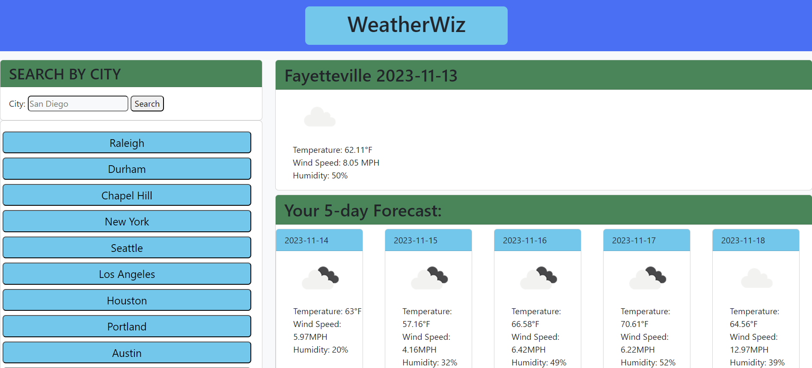

# Weather-App

## Description
A weather forecast dashboard. Several prominent cities are listed on the left side, along with a search bar. In the center, there is a large tab for today's forecast, and below is a 5-day forecast.

## Usage
When you first open the app, it will display a forecast of the default city, Seattle. You can then click any of the 
buttons on the left to get a forecast of any of these cities. The app will remember the last city you looked at. You may also type the name of a city in the search bar, and the app will try to fetch forecast data for what you type in. A new button will be added to the left side for the city you searched. 

## Credits
Collier Cobb helped me figure out API calls :\)

## License
This app uses the MIT license.